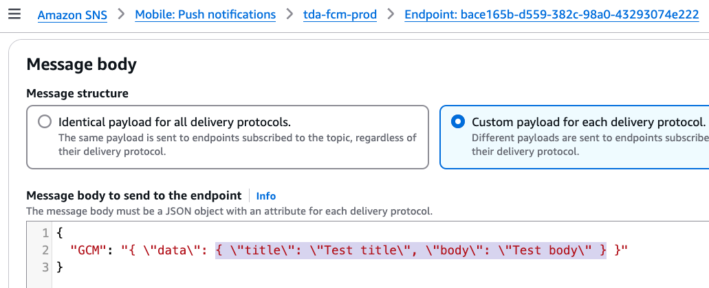

# React Native Push Notification Setting

## Create certificate
### iOS
1. 產生Certificate Signing Request
  1. Go to keychain.access > 類別選「所有項目」> (滑到畫面右上角，顯示應用程式訊息)鑰匙圈存取 > 憑證輔助程式 > 從憑證授權要求憑證
  2. 填寫email > 儲存到磁碟 > 修改檔名（optional） > 儲存
2. 到 Console 產生 Certificate
  1. Go to Apple Developer https://developer.apple.com/
  2. identifiers > 進入該project 
  3. push notification configure > Production SSL Certificate > create Certificate and upload 剛剛的 request file
  4. download 憑證（aps.cer）
  5. 點擊憑證加入keychain > 進入keychain 右鍵剛剛的憑證輸出 .p12 檔
  6. 將p12檔 給 backend
  
> 將憑證備份，不可弄丟  
  
### Android
1. Go to Firebase Console https://firebase.google.com/
2. 如果已有專案 > 設定 > 服務帳戶 > 產生一個私鑰檔案 > 上傳到 aws sns 選擇token(recommend)（舊版的棄用）伺服器金鑰 > 複製憑證 給 backend


## AWS settings
- 以aws發送（也可以用firebase，但公司統一用aws）  
- backend 進入aws SNS，mobile > push notification  > create platform application (建立兩個)   
- ios:
  - Push platform: Apple ios ,
  - uses for development sandbox(不用勾選),
  - push service ios
  - upload certiface p12
- android:
  - Push platform: firebase cloud FCM
  - token (recommended)
  - upload file from firebase

## Install library
```bash
npm install --save react-native-push-notification
npm install --save @react-native-community/push-notification-ios 
```

### In iOS Xcode Capability
- Background Mode capability and tick Remote Notifications.
- Push Notifications capability

### iOS native setting
https://github.com/react-native-push-notification/ios

### Android setting & React Native usage
https://github.com/zo0r/react-native-push-notification?tab=readme-ov-file

# 測試
- Android 可以在development 模式測試，iOS 則要在testflight 測試
- 1. 步驟：Application platform Detail > Endpoints tab(一個 device 一個record) > create application endpoint 填 device token 
- 2. 在detail 點 publish > custom payload for each delivery protocol
     - ios 使用預設payload
     - android 使用下圖payload，要有title、body，因為frontend library有這限制，格式如下圖
       
- 說明：android 會收到notification(in terminal)，但是手機通知列，是由前端native產生詳見可看node_module/react-native-push-notification/...RNPushNotification.java，ios 由system主動顯示通知列
- 說明：也可以用 adb logcat grep TAG 觀察有沒有exception
- 說明：idential 跟aws 有自訂的payload


## 注意
- IOS PushNotification sandbox 指：local developemnt 環境。只要是經過 Apple （testflight、app store）release 的 app，都「不屬於」sandbox！
